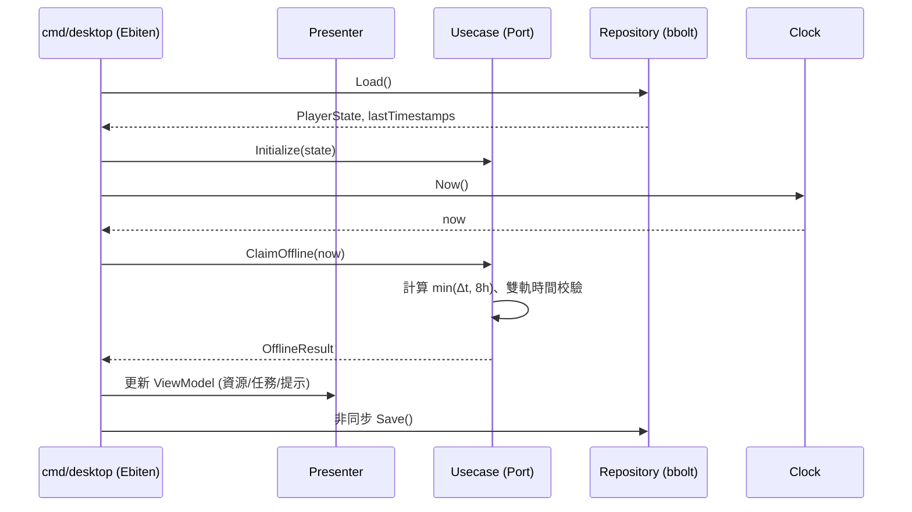
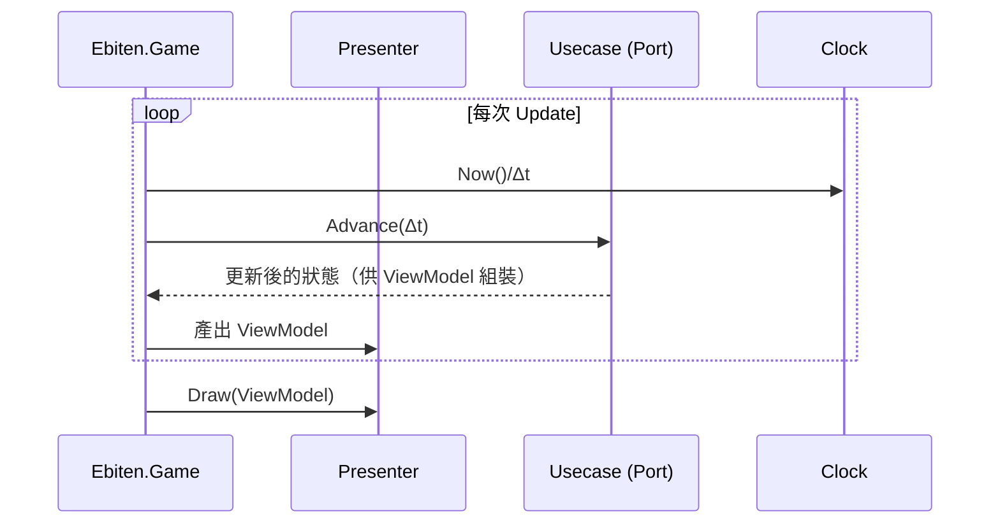
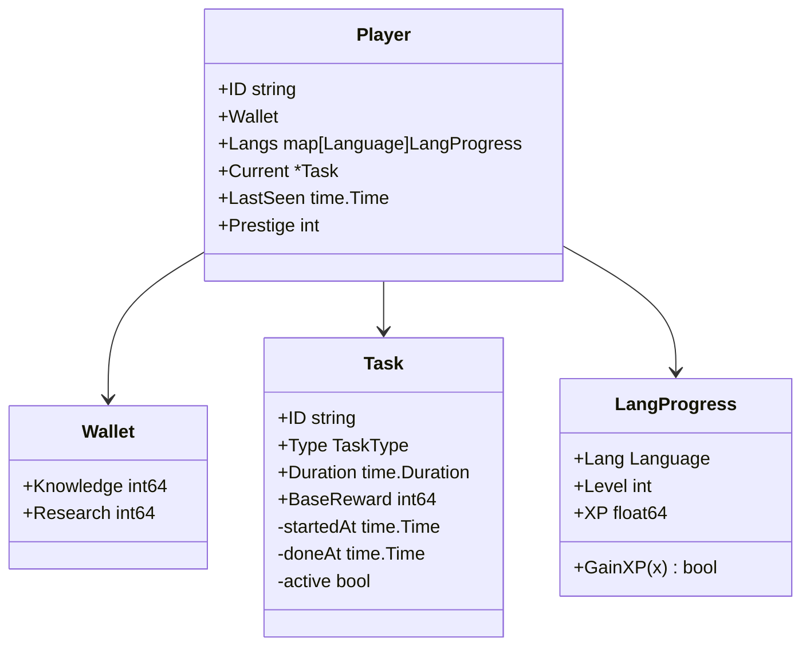

# 架構草圖（Clean Architecture × Ebiten Presenter × 離線存檔）

本文提供專案的高階原理圖、序列圖與資料流，協助各層分工與實作落地。

## 1) 元件與分層原理圖

```mermaid
flowchart LR
  %% Presentation / Adapter
  subgraph A[Adapter / Presenter]
    CLI[CLI] --- PUI[Ebiten UI]
    PUI -->|輸入事件/Render| PRES[Presenter]
    CLI --> PRES
  end

  %% Usecase
  subgraph U[Usecase]
    PORT[Usecase Port\n(例如: StartPractice/Advance/ClaimOffline/GetViewModel)]
  end

  %% Domain
  subgraph D[Domain]
    AGG[(Player / Task / LangProgress / Wallet)]
    SRV[Domain 服務]
  end

  %% Infra
  subgraph I[Infra]
    REPO[(Repository 實作\n bbolt)]
    CLOCK[(System Clock)]
  end

  PRES --> PORT
  PORT <--> AGG
  SRV --- AGG
  PORT -->|讀/寫| REPO
  PORT --> CLOCK
```

- Ebiten 只負責輸入/渲染，由 Presenter 轉為 Usecase Port 呼叫；Domain 保持純邏輯。
- 資料存取走 Repository 介面，Infra 提供 bbolt 實作；Clock 以介面注入，利於測試與離線時間計算。

## 2) 啟動與離線收益序列圖



要點：
- 讀檔後立即執行離線收益（封頂 8 小時）；若時間異常，採保守結算並提示。
- 存檔以背景執行，避免阻塞 Ebiten Update。

## 3) 遊戲主迴圈（Update/Draw）



建議：以 Advance(Δt) 驅動邏輯，避免在 Domain 直接呼叫 time.Now()，利於測試與可重播性。

## 4) 介面約定（簡述）

- Usecase Input Port（例）：
  - StartPractice(lang, duration)
  - StartSolve(taskID)
  - Advance(dt)
  - ClaimOffline(now)
  - GetViewModel() → ViewModel
  - Save()/Load()

- Repository Port（例）：
  - Load() (PlayerState, timestamps)
  - Save(PlayerState, timestamps)

- ViewModel（例）：
  - 資源：知識點、研發點
  - 語言：等級、XP、下一級需求
  - 任務：當前任務、剩餘時間
  - 訊息：離線收益提示/時間異常提示

## 5) 領域模型速覽（MVP）



此為 MVP 參考，後續會擴充技能樹、事件等聚合。

## 6) 時間校驗（離線）

- 儲存兩種資料：
  - wallClockAtClose：關閉時的 time.Now
  - elapsedMonotonic：本次執行累計的單調時間代理值
- 啟動時計算：
  - offlineSeconds = clamp(now - wallClockAtClose, 0..8h)
  - 若與 elapsedMonotonic 期望值嚴重不符 → 採保守結算並提示

## 7) 目錄對應

```
/domain       # 純領域邏輯
/usecase      # Usecase/Port 與流程協調
/adapter      # Presenter(UI)、Repo 介面實作
/infra        # bbolt、Clock 等技術細節
/cmd/cli      # CLI 入口（保留 smoke test）
/cmd/desktop  # Ebiten 入口與 wiring
```

以上為實作指引，細節可依 MVP 推進逐步落地與調整。
